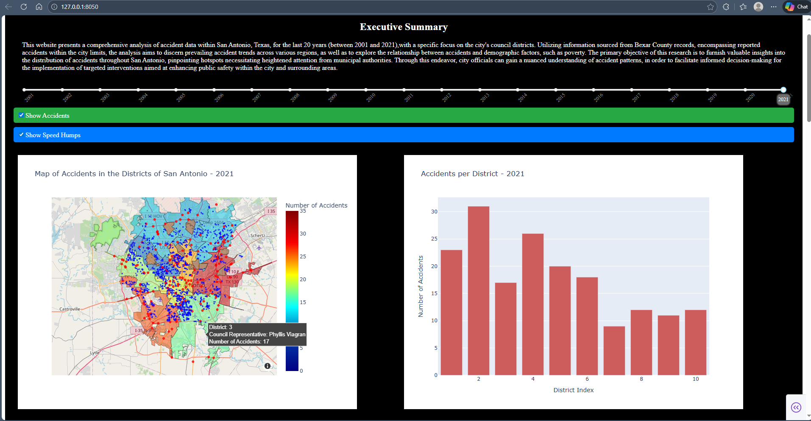
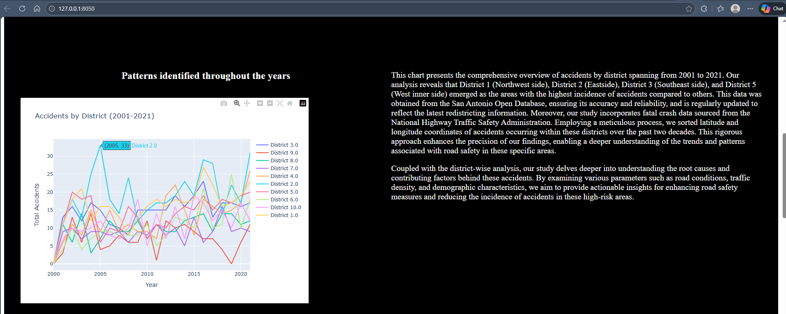
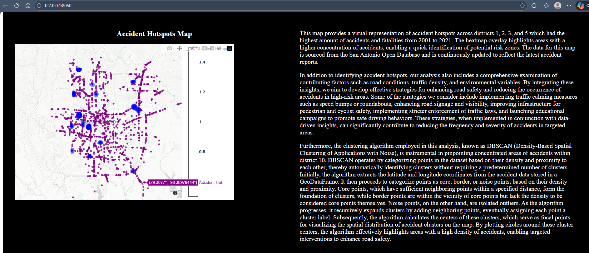
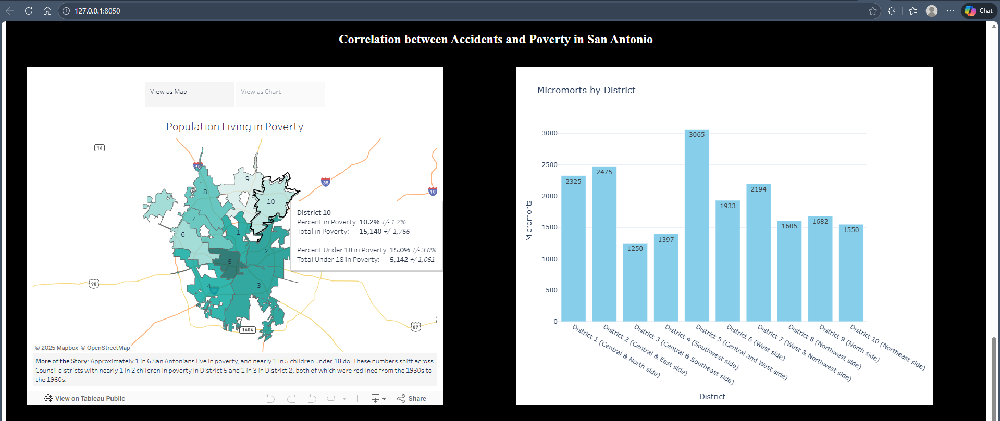

# San Antonio Crash Risk Explorer (Spatial + Temporal)

This project was co-developed under the guidance of my research mentor (co-advised) as part of an ongoing research effort on traffic safety in San Antonio. It turns San Antonio crash data into an interactive experience where you can explore spatial patterns, time trends, and high risk areas. The goal is to make crash risk easier to see and talk about, especially when it overlaps with infrastructure gaps and neighborhood level conditions.

## What it can do
* Explore crash hotspots on an interactive map
* Look at trends over time (depending on what fields exist in the dataset)
* Compare patterns across boundary layers (council districts, growth areas, other cities/towns)
* Overlay context layers like streets and speed humps
## Visuals (Interactive Dashboard)

These are screenshots of the interactive dashboard (hover tooltips, zoom/pan, and filtering via the year slider + toggles).

### 2021 Snapshot (Map + District Counts)


### Trends Across Time (2001–2021)


### Hotspots View


### Safety + Equity (Poverty + Micromorts)


## What is in this repo
* `main.py` runs the workflow and builds the map output
* `Council_Districts.geojson` boundary layer
* `InclusiveGrowthAreas.geojson` boundary layer
* `Streets.geojson` street layer
* `Traffic_Speed_Humps.geojson` infrastructure layer
* `Other_Cities_Towns.geojson` additional boundary layer

## Quick start (run the dashboard locally)

This project is a Dash + Plotly web app. Once it’s running, you can explore crashes across San Antonio with a year slider, layer toggles, and linked charts.

### Setup + run
```bash
# 1) Clone + enter repo
git clone https://github.com/CristianMoran1/SpatialTemporalAccidentAnalysis_WP.git
cd SpatialTemporalAccidentAnalysis_WP

# 2) Create + activate virtual environment
python -m venv .venv

# Windows (PowerShell)
.\.venv\Scripts\activate

# macOS/Linux (use this instead of the Windows line above)
# source .venv/bin/activate

# 3) Install dependencies
pip install -r requirements.txt

# 4) Run the app
python main.py

# 5) Open locally in your browser
example: (http://127.0.0.1:8050/)
```
## Project timeline

This repo reflects work done over time (original analysis + recent cleanup for the MLH code sample).

- Early build: collected and organized San Antonio crash + boundary layers, then built the first working dashboard to explore patterns by year and district.
- Iteration: added multiple views (district snapshot, long-term trends, hotspot clustering, and the safety + equity context section).
- Recent updates (for this repo): improved documentation, added screenshots of the running app, and made setup steps clearer so someone else can run it locally.

If you are reviewing this as a code sample, the core value is the end to end pipeline (data to geospatial joins to interactive visuals) and how the interface supports exploration instead of a single static result.


## Changelog

### 2025 12
- Updated README with a clearer setup and run workflow.
- Added dashboard screenshots under `assets/` to show the interactive UI.
- Cleaned up the repo structure and documentation so it is easier for others to reproduce locally.

### Earlier development
- Built the initial dashboard for exploring crash patterns across San Antonio council districts (2001 to 2021).
- Added district-level summaries, long-term trend views, hotspot clustering visualization, and the safety + equity context section.


## Troubleshooting

- If `python main.py` runs but the page does not open, look in the terminal for the local URL (usually `http://127.0.0.1:8050/`) and open it manually.
- If you see dependency issues, re-run:
  - `pip install -r requirements.txt`
- If you are using a new Python version and geospatial packages complain, try creating a fresh virtual environment and reinstalling requirements.


## Notes on interpretation

This dashboard is meant for exploration and communication. Hotspots and clustering highlight where crashes concentrate, but they are not causal claims. The goal is to surface patterns that can guide deeper investigation or policy discussion.
